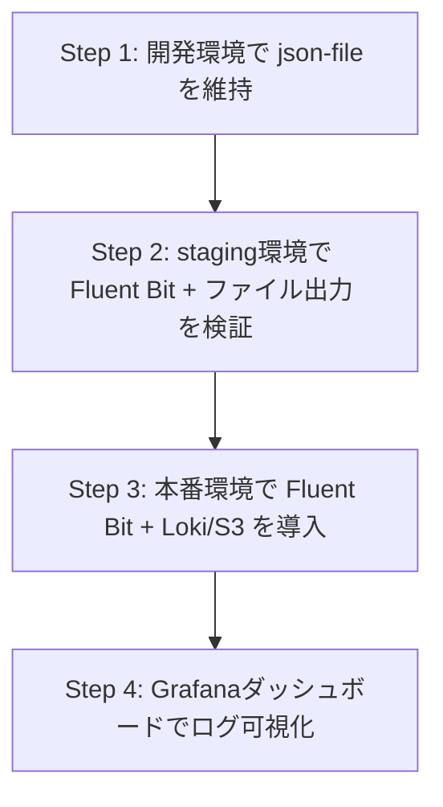

# Docker Composeへのログ収集コンテナ導入検討

> [!abstract] 概要
> Docker Compose環境にFluentdなどのログ収集コンテナを追加すべきかの検討資料。
> 
> 👉 具体的な実装は [[Docker/FluentBit推奨構成|推奨構成]] を参照

---

## 現在の環境分析

### 構成

| コンポーネント | コンテナ数 | 備考 |
|---------------|-----------|------|
| Laravel 11 (PHP) | 3 | php, scheduler, queue |
| Nginx | 1 | リバースプロキシ |
| Redis Cluster | 6 | 3 master + 3 replica |
| MariaDB Galera | 3 | 3ノードクラスター |
| Postfix | 1 | メール送信 |
| **合計** | **14** | |

### 現在のログ設定

```yaml
x-common-configs: &x-common-configs
  logging:
    driver: json-file
    options:
      max-size: 1m
      max-file: "14"
```

- **json-file ドライバー** を使用中
- ログローテーション設定済み（1MB × 14ファイル = 最大14MB/コンテナ）
- 全コンテナに共通設定を適用

---

## Fluent Bit導入の判断ポイント

### ✅ 導入すべきケース

> [!tip] こんな場合は導入を検討
> | 状況 | 理由 |
> |------|------|
> | **本番環境で運用中** | 障害調査時にログの横断検索が必須 |
> | **複数環境の一元管理** | staging, productionのログ統合 |
> | **ログの長期保存が必要** | 監査・コンプライアンス要件 |
> | **リアルタイム監視が必要** | アラート連携、異常検知 |
> | **チーム開発** | 複数メンバーがログにアクセス |

### ❌ 導入不要なケース

> [!warning] こんな場合は不要
> | 状況 | 理由 |
> |------|------|
> | **開発環境のみ** | `docker compose logs -f` で十分 |
> | **単一開発者** | オーバーヘッドがメリットを上回る |
> | **AWSなどPaaS利用予定** | CloudWatch Logs等で代替可能 |

---

## メリット・デメリット比較

### メリット

> [!success] メリット
> | # | メリット | 詳細 |
> |---|---------|------|
> | 1 | **ログの一元管理・横断検索** | 全14コンテナのログを一箇所で検索可能。Laravel/nginx/mariadb/redisのエラーを相関分析 |
> | 2 | **柔軟な出力先** | Elasticsearch, S3, BigQuery, [[Docker/FluentBitFAQ#2-lokiとは何か|Loki]] など。出力先の切り替えがアプリ変更なしで可能 |
> | 3 | **ログの構造化** | Laravelのログを自動パース。JSONフィールドによる高精度フィルタリング |
> | 4 | **コンテナ停止時のログ保全** | json-file driver: コンテナ削除でログ消失。fluentd: 外部ストレージに永続化 |

### デメリット

> [!failure] デメリット
> | # | デメリット | 詳細 |
> |---|-----------|------|
> | 1 | **リソース消費** | Fluentd: 約50-100MB RAM / Fluent Bit: 約5-15MB RAM（軽量版） |
> | 2 | **複雑性の増加** | 設定ファイル管理（fluent.conf）、プラグイン依存関係、Fluentd障害時のログ消失リスク |
> | 3 | **起動順序の制約** | Fluentdが起動前だとコンテナ起動失敗。depends_on + healthcheck 必須 |
> | 4 | **学習コスト** | Fluentd設定構文の習得、トラブルシューティング |

---

## 代替ツールの比較（2025年現在）

| ツール | メモリ使用量 | 特徴 | 推奨ケース |
|--------|-------------|------|-----------|
| **Fluentd** | 50-100MB | プラグイン豊富、成熟 | 大規模・複雑な要件 |
| **Fluent Bit** | 5-15MB | 軽量、CNCF標準 | **Docker環境に最適** |
| **Vector** | 10-20MB | Rust製、高速 | 高スループット要件 |
| **Promtail + Loki** | 30-50MB | Grafana連携 | Prometheus既存環境 |

> [!info] 推奨: Fluent Bit
> 2025年現在、Docker Compose環境では **Fluent Bit** が推奨:
> - Fluentdの軽量版・互換性あり
> - CNCFでFluentdと同プロジェクト
> - ほぼ全てのFluentdプラグイン互換

---

## 実装例（Fluent Bit + Loki構成）

> [!note] 詳細な実装
> より詳細な設定は [[Docker/FluentBit推奨構成#phase-1-本番環境にfluent-bit導入ファイル出力のみ|推奨構成 - Phase 1]] を参照

### 1. compose.yaml への追加

```yaml
services:
  # 既存サービス...
  
  fluent-bit:
    image: fluent/fluent-bit:3.2
    hostname: fluent-bit
    volumes:
      - ./docker/fluent-bit/fluent-bit.conf:/fluent-bit/etc/fluent-bit.conf:ro
      - ./docker/fluent-bit/parsers.conf:/fluent-bit/etc/parsers.conf:ro
    networks:
      - base-net
    healthcheck:
      test: ["CMD", "curl", "-f", "http://localhost:2020/api/v1/health"]
      interval: 10s
      timeout: 5s
      retries: 3
    <<: *x-common-configs

  # 可視化が必要な場合
  loki:
    image: grafana/loki:3.2.0
    hostname: loki
    command: -config.file=/etc/loki/local-config.yaml
    volumes:
      - ./docker/loki:/etc/loki
    networks:
      - base-net
    <<: *x-common-configs
```

### 2. ログドライバー設定の変更

```yaml
x-common-configs: &x-common-configs
  logging:
    driver: fluentd
    options:
      fluentd-address: "fluent-bit:24224"
      fluentd-async: "true"  # 非同期送信（Fluent Bit起動前でもコンテナ起動可）
      tag: "docker.{{.Name}}"
```

### 3. fluent-bit.conf の例

```ini
[SERVICE]
    Flush         5
    Daemon        Off
    Log_Level     info
    Parsers_File  parsers.conf
    HTTP_Server   On
    HTTP_Listen   0.0.0.0
    HTTP_Port     2020

[INPUT]
    Name          forward
    Listen        0.0.0.0
    Port          24224

# Laravelログのパース
[FILTER]
    Name          parser
    Match         docker.php*
    Key_Name      log
    Parser        laravel
    Reserve_Data  On

# 出力: ファイル（ローカル保存）
[OUTPUT]
    Name          file
    Match         *
    Path          /fluent-bit/log/
    Format        json_lines

# 出力: Loki（可視化する場合）
[OUTPUT]
    Name          loki
    Match         *
    Host          loki
    Port          3100
    Labels        job=docker, container=$TAG
```

### 4. parsers.conf（Laravelログ用）

```ini
[PARSER]
    Name          laravel
    Format        regex
    Regex         ^\[(?<time>[^\]]+)\] (?<env>\w+)\.(?<level>\w+): (?<message>.*)$
    Time_Key      time
    Time_Format   %Y-%m-%d %H:%M:%S
```

---

## 段階的導入のステップ



---

## 関連ドキュメント

### Docker関連
- [[Docker/FluentBit推奨構成|推奨構成]] - 具体的な実装計画
- [[Docker/FluentBitFAQ|FAQ]] - よくある質問

### その他
- [[../Index|ホーム]] - 目次に戻る

---

## 参考リンク

- [Fluent Bit 公式ドキュメント](https://docs.fluentbit.io/)
- [Docker Logging Drivers](https://docs.docker.com/config/containers/logging/configure/)
- [Grafana Loki](https://grafana.com/oss/loki/)

---

*作成日: 2025年11月*

