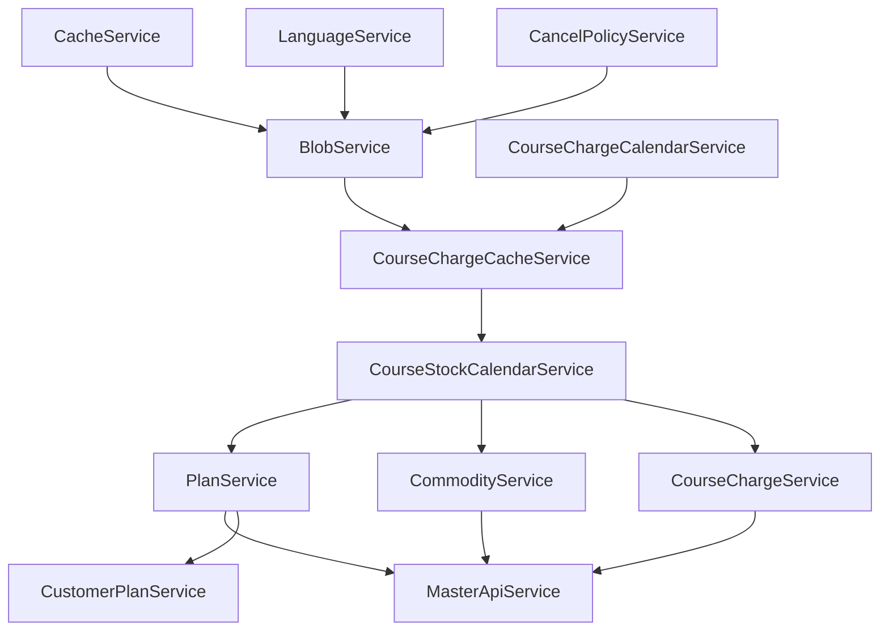

# Reservation系以外の循環参照問題分析

タグ: #laravel #refactoring #dependency-injection #circular-dependency

---

## 📋 目次

- [[#問題点リスト]]
- [[#修正優先順位]]
- [[#修正方針]]
- [[#各サービスの修正案詳細]]

---

## 問題点リスト

### 1. **PlanService** - 複数のサービスを`new`で直接インスタンス化

**問題箇所:**
- コンストラクタ: `new CancelPolicyService()`, `new BlobService()`, `new LanguageService()`
- メソッド内: `new CacheService()`, `new CourseChargeCacheService()`, `new CourseChargeCalendarService()`

**影響:**
- DIコンテナを経由しないため、テストが困難
- 依存関係が不明確
- 循環参照のリスク

**修正案:**
- コンストラクタでDIを使用
- メソッド内の`new`もDIに変更、または必要なサービスをコンストラクタで注入

---

### 2. **CourseStockCalendarService** - ReservationCommodityServiceを直接インスタンス化

**問題箇所:**
- コンストラクタ: `new ReservationCommodityService()`

**影響:**
- Reservation系サービスへの直接依存（既に解決済みのはずだが、確認が必要）

**修正案:**
- コンストラクタでDIを使用
- または`app()->make()`を使用（Reservation系への依存を緩和）

---

### 3. **CourseChargeCalendarService** - メソッド内でサービスを直接インスタンス化

**問題箇所:**
- メソッド内: `new CourseChargeCacheService()`, `new LanguageService()`

**影響:**
- DIコンテナを経由しない
- 依存関係が不明確

**修正案:**
- コンストラクタでDIを使用

---

### 4. **CommodityCalendarService** - メソッド内でサービスを直接インスタンス化

**問題箇所:**
- メソッド内: `new CourseChargeCacheService()`, `new CourseChargeCalendarService()`, `new LanguageService()`

**影響:**
- DIコンテナを経由しない
- 依存関係が不明確
- `CourseChargeCalendarService`への自己参照の可能性

**修正案:**
- コンストラクタでDIを使用

---

### 5. **MasterApiService** - 複数のサービスを直接インスタンス化

**問題箇所:**
- コンストラクタ: `new CourseChargeCalendarService()`, `new CourseStockCalendarService()`
- メソッド内: `new PlanService()`, `new CommodityService()`

**影響:**
- DIコンテナを経由しない
- 依存関係が不明確
- 循環参照のリスク（PlanService ↔ MasterApiService）

**修正案:**
- コンストラクタでDIを使用
- メソッド内の`new`もDIに変更

---

### 6. **CourseChargeService** - メソッド内でサービスを直接インスタンス化

**問題箇所:**
- メソッド内: `new CourseChargeCacheService()`

**影響:**
- DIコンテナを経由しない
- 依存関係が不明確

**修正案:**
- コンストラクタでDIを使用

---

### 7. **BlobService** - CacheServiceを直接インスタンス化

**問題箇所:**
- コンストラクタ: `new CacheService()`

**影響:**
- DIコンテナを経由しない
- 依存関係が不明確

**修正案:**
- コンストラクタでDIを使用

---

### 8. **HostCompanyService** - CancelPolicyServiceを直接インスタンス化

**問題箇所:**
- コンストラクタ: `new CancelPolicyService()`

**影響:**
- DIコンテナを経由しない
- 依存関係が不明確

**修正案:**
- コンストラクタでDIを使用

---

### 9. **RosterService** - ReservationLanguageServiceを直接インスタンス化（要確認）

**問題箇所:**
- メソッド内: `new ReservationLanguageService()`（要確認）

**影響:**
- Reservation系サービスへの直接依存

**修正案:**
- コンストラクタでDIを使用

---

## 修正優先順位

### 高優先度（循環参照のリスクが高い）
1. **PlanService** - 多くのサービスに依存し、多くのサービスから依存されている
2. **MasterApiService** - PlanServiceと相互依存の可能性
3. **CourseChargeCalendarService** - 多くのサービスから使用されている

### 中優先度（依存関係の明確化）
4. **CommodityCalendarService** - CourseChargeCalendarServiceへの依存
5. **CourseStockCalendarService** - Reservation系への依存
6. **CourseChargeService** - メソッド内での`new`使用

### 低優先度（単純な依存関係）
7. **BlobService** - CacheServiceのみ
8. **HostCompanyService** - CancelPolicyServiceのみ
9. **RosterService** - ReservationLanguageServiceのみ（要確認）

---

## 修正方針

### 基本方針
1. すべての`new ServiceName()`をコンストラクタでのDIに変更
2. メソッド内での`new`も、可能な限りコンストラクタでのDIに変更
3. 循環参照が発生する場合は、`app()->make()`を使用（一時的な回避策）
4. 最終的には、依存関係の方向性を整理して循環参照を解消

### 依存関係の方向性（目標）



---

## 各サービスの修正案詳細

### PlanService

```php
// 修正前
public function __construct()
{
    $this->o_cancel_policy_service = new CancelPolicyService();
    $this->o_blob_service = new BlobService();
    $this->languageService = new LanguageService();
}

// 修正後
public function __construct(
    private readonly CancelPolicyService $o_cancel_policy_service,
    private readonly BlobService $o_blob_service,
    private readonly LanguageService $languageService,
    private readonly CacheService $cacheService,
    private readonly CourseChargeCacheService $courseChargeCacheService,
    private readonly CourseChargeCalendarService $courseChargeCalendarService
) {}
```

### MasterApiService

```php
// 修正前
public function __construct()
{
    $this->chargeCalendarService = new CourseChargeCalendarService();
    $this->stockCalendarService = new CourseStockCalendarService();
}

// 修正後
public function __construct(
    private readonly CourseChargeCalendarService $chargeCalendarService,
    private readonly CourseStockCalendarService $stockCalendarService,
    private readonly PlanService $planService,
    private readonly CommodityService $commodityService
) {}
```

### BlobService

```php
// 修正前
public function __construct()
{
    $this->cacheService = new CacheService();
}

// 修正後
public function __construct(
    private readonly CacheService $cacheService
) {}
```

### HostCompanyService

```php
// 修正前
public function __construct()
{
    $this->o_cancel_policy_service = new CancelPolicyService();
}

// 修正後
public function __construct(
    private readonly CancelPolicyService $o_cancel_policy_service
) {}
```

### CourseStockCalendarService

```php
// 修正前
public function __construct()
{
    $this->reservationCommodityService = new ReservationCommodityService();
}

// 修正後（Reservation系への依存を緩和する場合）
public function __construct() {}

// または、DIを使用する場合
public function __construct(
    private readonly ReservationCommodityService $reservationCommodityService
) {}
```

### CourseChargeCalendarService

```php
// 修正前
public function __construct() {}

// 修正後
public function __construct(
    private readonly LanguageService $languageService,
    private readonly CourseChargeCacheService $courseChargeCacheService
) {}
```

### CommodityCalendarService

```php
// 修正前
public function __construct() {}

// 修正後
public function __construct(
    private readonly LanguageService $languageService,
    private readonly CourseChargeCacheService $courseChargeCacheService,
    private readonly CourseChargeCalendarService $courseChargeCalendarService
) {}
```

### CourseChargeService

```php
// 修正前
public function __construct(
    private readonly CourseStockCalendarService $stockCalendarService,
    private readonly CourseChargeCalendarService $chargeCalendarService,
    private readonly LanguageService $languageService
) {}

// 修正後
public function __construct(
    private readonly CourseStockCalendarService $stockCalendarService,
    private readonly CourseChargeCalendarService $chargeCalendarService,
    private readonly LanguageService $languageService,
    private readonly CourseChargeCacheService $courseChargeCacheService
) {}
```

