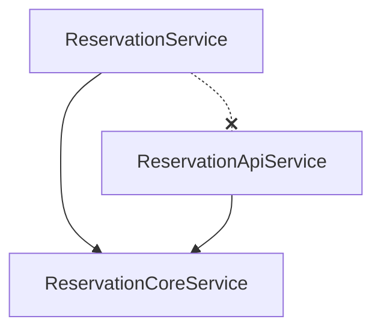

# サービス設計のファクトチェックと推奨方針

AIが生成した設計案に対するファクトチェックを行い、Laravelプロジェクトとして採用すべき正しい方針をまとめました。

## 1. AI提案のファクトチェック（要注意事項）

### ❌ 「Facade（ファサード）」という名称の使用
AIはGoFデザインパターンとしての「Facade」を推奨しましたが、Laravelプロジェクトでは**この名称は避けるべき**です。

*   **理由**: Laravelには既に[`Illuminate\Support\Facades`](https://laravel.com/docs/facades)（例: `DB`, `Route`, `Log`）という強力な機能が存在します。自作のサービスクラスに `ReservationFacadeService` などの名前をつけると、Laravel標準のFacade機能と混同し、致命的な混乱を招きます。
*   **正しい対応**: パターンとしてのFacade（窓口）を実装する場合でも、名称は以下のように変更します。
    *   `~UseCase` （ユースケース）
    *   `~Action` （単一アクション）
    *   `~Coordinator` （調整役）
    *   `~Manager` （管理役）

### ⚠️ `app()->make()` の恒久利用
AIは `app()->make()` を推奨しましたが、これは「Service Locatorパターン」と呼ばれるアンチパターンの一種になり得ます。

*   **理由**: コンストラクタで依存を示さず、メソッド内で隠れて依存解決を行うため、依存関係が見えなくなり、ユニットテストでのモック差し替えが難しくなります。
*   **正しい対応**: `app()->make()` はあくまで**循環参照を回避するための一時的な処置（Workaround）** と認識し、長期的にはリファクタリング（共通処理の切り出し）を目指すべきです。

### ⚠️ 「Coordinator」という名称
AIは「CoordinatorはiOS特有」と指摘しましたが、サーバーサイドでもSagaパターンなどで使われることはあります。ただし、認知度は低いため、チーム内で合意がなければ `UseCase` や `Service` の方が無難です。

---

## 2. 用語の定義と整理

混乱が生じている「中間サービス」などの用語を再定義します。

| 用語 | AIの説明での扱い | Laravelでの正しい解釈・実装 |
| :--- | :--- | :--- |
| **中間サービス** | (1) コントローラーとサービスの間に挟むもの<br>(2) 共通処理を切り出したもの | **Core Service / Shared Service**<br>循環参照を解消するために、共通ロジックを切り出した下位レイヤーのサービス。 |
| **Facade** | 複数のサービスをまとめる窓口 | **Use Case / Complex Service**<br>ビジネスロジックの流れ（ワークフロー）を制御する上位レイヤーのサービス。**名称にFacadeは使わない。** |
| **Coordinator** | 処理の調整役 | **同上**<br>Use Caseに近い役割。名称としては許容範囲だが、チームの合意が必要。 |

---

## 3. 循環参照解決のロードマップ（決定版）

プロジェクトの現状とリスクを考慮した、段階的な解決策です。

### Step 1: 緊急避難（現状維持 + `app()->make()`）
**目的**: 今起きているエラーを止める、または実装を進める。

*   循環参照している箇所のみ、コンストラクタインジェクションを止め、メソッド内で `app()->make()` を使用する。
*   **メリット**: 既存のコード構造を破壊せず、修正が最小限。
*   **デメリット**: テストがしにくい。依存が見えにくい。

```php
// 一時的な対応
public function reserve(...) {
    // 循環参照回避のためここだけで解決
    $service = app()->make(ReservationService::class);
    $service->doSomething();
}
```

### Step 2: 共通処理の切り出し（推奨・正攻法）
**目的**: 構造的に循環参照を解消する。

*   `ReservationService` と `ReservationApiService` が相互に依存している原因（共通で使いたいロジック）を特定する。
*   そのロジックを **第三のサービス（例: `ReservationCoreService`）** に移動させる。
*   両方のサービスから `ReservationCoreService` に依存させる（V字型の依存）。



### Step 3: コントローラーの整理（必要に応じて）
**目的**: コントローラーが肥大化した場合の対応。

*   コントローラーが複数のサービスを呼び出しすぎて複雑になった場合のみ、それらをまとめる **Use Caseクラス**（またはCoordinator）を導入する。
*   これは循環参照解決とは別の「責務の分離」の話であるため、Step 2とは切り離して考える。

---

## 4. 結論：本プロジェクトの方針

1.  **名称**: `Facade` という名前の自作クラスは**禁止**。
2.  **短期対応**: `app()->make()` で循環参照を回避して実装を進めることは**許容**する。
3.  **中長期対応**: 循環参照の原因となっているロジックを `Core` または `Shared` ディレクトリ配下のサービスに切り出す（Step 2のアプローチ）ことを目指す。

## 関連ドキュメント

- [[Laravel/一方向依存関係のルール強制方法|一方向依存関係のルール強制方法]]
- [[Projects/予約ドメインの循環参照解決とサブドメイン分割戦略|予約ドメインの循環参照解決とサブドメイン分割戦略]]
- [[Index|ホーム]]

