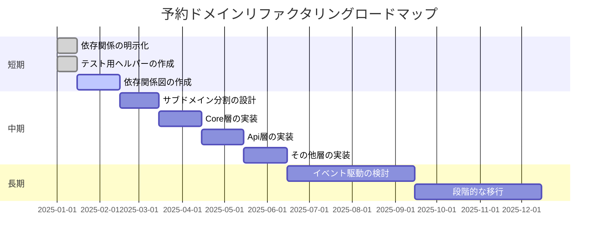

# 予約ドメインの循環参照解決とサブドメイン分割戦略

#Laravel #DDD #アーキテクチャ #リファクタリング #予約ドメイン

## 📋 目次

- [[#現状の問題|現状の問題]]
- [[#解決策の選択肢|解決策の選択肢]]
- [[#推奨アプローチ|推奨アプローチ]]
- [[#サブドメイン分割の詳細設計|サブドメイン分割の詳細設計]]
- [[#実装優先度とロードマップ|実装優先度とロードマップ]]

---

## 🔴 現状の問題

### 循環参照の存在

`Reservation/` ディレクトリ内で以下の循環参照が存在しています：

1. `ReservationService` ↔ `ReservationApiService`
2. `ReservationService` ↔ `ReservationVerificationService`
3. `ReservationApiService` ↔ `DynamicPackageReservationService`
4. `ReservationCommodityService` ↔ `ReservationApiService`
5. `ReservationCommodityService` ↔ `ReservationService`

### 問題点

- **テストの困難さ**：循環参照により、モックの注入が複雑になる
- **依存関係の不明確さ**：どのクラスが何に依存しているか把握しにくい
- **保守性の低下**：変更時の影響範囲が広がる
- **責務の曖昧さ**：各サービスの役割が明確でない

---

## 💡 解決策の選択肢

### 1. 遅延注入（現在の実装）✅ 短期推奨

**概要：**
`app()->make()`を使用して、必要な時にサービスを取得する方法。

**メリット：**
- ✅ 実装が簡単
- ✅ 既存コードの変更が最小限
- ✅ 循環参照を完全に回避

**デメリット：**
- ❌ テスト時にモックが難しい
- ❌ 依存関係が暗黙的になる
- ❌ 静的解析ツールで検出しにくい

**適用例：**
```php
// ReservationApiService.php
public function reserve(ReserveRequest $o_request) {
    /**
     * @uses ReservationService::createReservationCode()
     * 循環参照を回避するため、app()->make()で取得
     */
    $s_new_reserve_code = app()->make(ReservationService::class)
        ->createReservationCode($o_request)->first();
}
```

**改善案：**
```php
// コメントで依存関係を明示
/**
 * @uses ReservationService::createReservationCode()
 * 循環参照を回避するため、app()->make()で取得
 */
$service = app()->make(ReservationService::class);
```

---

### 2. 中間サービス（Coordinator/Mediator）パターン

**概要：**
複数のサービスを調整する専用のサービスを導入する方法。

**構造：**
```
Reservation/
├── Core/                          # コア機能（循環参照なし）
│   ├── ReservationService.php
│   └── ReservationVerificationService.php
│
├── Api/                           # API層
│   └── ReservationApiService.php
│
├── Coordination/                  # 調整層（中間サービス）
│   └── ReservationCoordinatorService.php
│
└── DynamicPackage/
    └── DynamicPackageReservationService.php
```

**実装例：**
```php
// app/Services/Reservation/Coordination/ReservationCoordinatorService.php
namespace App\Services\Reservation\Coordination;

use App\Services\Reservation\Core\ReservationService;
use App\Services\Reservation\Api\ReservationApiService;
use App\Services\Reservation\Core\ReservationVerificationService;

readonly class ReservationCoordinatorService
{
    public function __construct(
        private readonly ReservationService $reservation_service,
        private readonly ReservationApiService $api_service,
        private readonly ReservationVerificationService $verification_service,
    ) {}

    /**
     * 予約作成と検証を調整
     */
    public function createReservationWithVerification(...) {
        // 検証
        $this->verification_service->validateRequestCourse(...);
        
        // 予約作成
        $reservation = $this->reservation_service->create(...);
        
        // API処理
        $this->api_service->syncReservationChargeTypes(...);
        
        return $reservation;
    }
}
```

**メリット：**
- ✅ 責務が明確に分離される
- ✅ テストしやすい
- ✅ 依存関係が明示的
- ✅ 既存コードへの影響が少ない

**デメリット：**
- ❌ 新しいクラスが必要
- ❌ ボイラープレートコードが増える
- ❌ 調整ロジックが集中する

---

### 3. サブドメイン分割 ✅ 中期推奨

**概要：**
Reservationドメインを階層的に分割し、一方向の依存関係を確立する方法。

**構造：**
```
app/Services/Reservation/
│
├── Core/                          # コア予約機能（循環参照なし）
│   ├── ReservationService.php
│   └── ReservationVerificationService.php
│
├── Api/                           # API層（Coreに依存）
│   └── ReservationApiService.php
│
├── Commodity/                     # 商材予約（Apiに依存）
│   └── ReservationCommodityService.php
│
├── ChargeType/                    # 料金区分（Coreに依存）
│   └── ReservationChargeTypeService.php
│
├── Language/                      # 予約言語（Coreに依存）
│   └── ReservationLanguageService.php
│
├── DynamicPackage/                # 動的パッケージ（Apiに依存）
│   ├── DynamicPackageReservationService.php
│   └── NorthDynamicPackageReservationService.php
│
└── Mail/                          # 予約メール（DynamicPackageに依存）
    └── NorthReservationMailService.php
```

**依存関係の方向：**
```
Core/
  ↑
  │ (依存)
  │
Api/
  ↑
  │ (依存)
  │
Commodity/, DynamicPackage/
  ↑
  │ (依存)
  │
Mail/
```

**メリット：**
- ✅ 循環参照の完全な回避
- ✅ 責務の明確化
- ✅ テストの容易さ
- ✅ 拡張性

**デメリット：**
- ❌ 移行コストが高い
- ❌ 名前空間の複雑化
- ❌ 後方互換性の維持が必要

詳細は[[#サブドメイン分割の詳細設計|サブドメイン分割の詳細設計]]を参照。

---

### 4. イベント駆動アーキテクチャ ✅ 長期検討

**概要：**
サービス間の直接呼び出しを避け、イベントを介して通信する方法。

**実装例：**
```php
// ReservationService.php
public function createReservation(...) {
    $reservation = $this->create(...);
    
    // イベントを発火（直接呼び出しを回避）
    event(new ReservationCreated($reservation));
    
    return $reservation;
}

// ReservationApiService.php
public function handleReservationCreated(ReservationCreated $event) {
    // 予約作成後の処理
    $this->syncReservationChargeTypes($event->reservation);
}
```

**構造：**
```
Reservation/
├── Core/
│   ├── ReservationService.php (イベント発火)
│   └── ReservationVerificationService.php
│
├── Api/
│   └── ReservationApiService.php (イベントリスナー)
│
└── Events/
    ├── ReservationCreated.php
    ├── ReservationUpdated.php
    └── ReservationCancelled.php
```

**メリット：**
- ✅ 完全に疎結合
- ✅ 拡張性が高い
- ✅ テストしやすい

**デメリット：**
- ❌ 実装が複雑
- ❌ デバッグが難しい
- ❌ 既存コードの大幅な変更が必要

---

## 🎯 推奨アプローチ

### 短期（現状維持 + 改善）

**現在の実装（遅延注入）を維持しつつ、以下の改善を実施：**

#### 1. 依存関係の明示化

```php
/**
 * @uses ReservationService::createReservationCode()
 * 循環参照を回避するため、app()->make()で取得
 */
$service = app()->make(ReservationService::class);
```

#### 2. テスト用ヘルパー

```php
// tests/Helpers/ReservationServiceHelper.php
class ReservationServiceHelper {
    public static function mockReservationService() {
        // テスト時にモックを注入
        $mock = Mockery::mock(ReservationService::class);
        app()->instance(ReservationService::class, $mock);
        return $mock;
    }
}
```

#### 3. 依存関係図の作成

- 各サービスの依存関係を可視化
- 循環参照の発生箇所を明確化

---

### 中期（サブドメイン分割）

**Reservationドメインを階層的に分割：**

詳細は[[#サブドメイン分割の詳細設計|サブドメイン分割の詳細設計]]を参照。

---

### 長期（イベント駆動 + サブドメイン）

**イベント駆動アーキテクチャを導入し、完全に疎結合に：**

- サブドメイン分割が完了した後
- 段階的にイベント駆動に移行
- 既存の機能を壊さないように注意深く実装

---

## 🏗️ サブドメイン分割の詳細設計

### 推奨構造

```
app/Services/Reservation/
│
├── Core/                          # コア予約機能（循環参照なし）
│   ├── ReservationService.php
│   └── ReservationVerificationService.php
│
├── Api/                           # API層（Coreに依存）
│   └── ReservationApiService.php
│
├── Commodity/                     # 商材予約（Apiに依存）
│   └── ReservationCommodityService.php
│
├── ChargeType/                    # 料金区分（Coreに依存）
│   └── ReservationChargeTypeService.php
│
├── Language/                      # 予約言語（Coreに依存）
│   └── ReservationLanguageService.php
│
├── DynamicPackage/                # 動的パッケージ（Apiに依存）
│   ├── DynamicPackageReservationService.php
│   └── NorthDynamicPackageReservationService.php
│
└── Mail/                          # 予約メール（DynamicPackageに依存）
    └── NorthReservationMailService.php
```

### 依存関係の方向

```
Core/
  ↑
  │ (依存)
  │
Api/
  ↑
  │ (依存)
  │
Commodity/, DynamicPackage/
  ↑
  │ (依存)
  │
Mail/
```

### 実装例

#### 1. Core層（循環参照なし）

```php
// app/Services/Reservation/Core/ReservationService.php
namespace App\Services\Reservation\Core;

readonly class ReservationService
{
    public function __construct(
        // 他のドメインからの依存のみ
        private readonly PaymentBusinessService $payment_service,
        private readonly CancelPolicyService $cancel_policy_service,
        // Core層内の依存は許可
        private readonly ReservationVerificationService $verification_service,
    ) {}
}
```

```php
// app/Services/Reservation/Core/ReservationVerificationService.php
namespace App\Services\Reservation\Core;

readonly class ReservationVerificationService
{
    public function __construct(
        // Core層内の依存は許可（ただし、ReservationServiceには依存しない）
        // 必要に応じて app()->make() で取得
    ) {}
    
    public function validateRequestCourse(...) {
        // ReservationService が必要な場合は遅延注入
        $reservation_service = app()->make(ReservationService::class);
        // ...
    }
}
```

#### 2. Api層（Coreに依存）

```php
// app/Services/Reservation/Api/ReservationApiService.php
namespace App\Services\Reservation\Api;

use App\Services\Reservation\Core\ReservationService;

readonly class ReservationApiService
{
    public function __construct(
        // Core層への依存（一方向）
        private readonly ReservationService $reservation_service,
        // 他の依存
        private readonly ReservationCommodityService $commodity_service,
    ) {}
}
```

#### 3. Commodity層（Apiに依存）

```php
// app/Services/Reservation/Commodity/ReservationCommodityService.php
namespace App\Services\Reservation\Commodity;

use App\Services\Reservation\Api\ReservationApiService;

readonly class ReservationCommodityService
{
    public function __construct(
        // Api層への依存（一方向）
        private readonly ReservationApiService $api_service,
        // 他の依存
        private readonly PaymentBusinessService $payment_service,
    ) {}
}
```

#### 4. DynamicPackage層（Apiに依存）

```php
// app/Services/Reservation/DynamicPackage/DynamicPackageReservationService.php
namespace App\Services\Reservation\DynamicPackage;

use App\Services\Reservation\Api\ReservationApiService;
use App\Services\Reservation\Core\ReservationService;

readonly class DynamicPackageReservationService
{
    public function __construct(
        // Core層とApi層への依存（一方向）
        private readonly ReservationService $reservation_service,
        private readonly ReservationApiService $api_service,
        // 他の依存
        private readonly PaymentBusinessService $payment_service,
    ) {}
}
```

### 移行手順

#### ステップ1: 名前空間の追加（後方互換性を保つ）

```php
// app/Services/Reservation/Core/ReservationService.php
namespace App\Services\Reservation\Core;

// 後方互換性のため、エイリアスを追加
class_alias(
    ReservationService::class,
    \App\Services\ReservationService::class
);
```

#### ステップ2: ServiceProviderの更新

```php
// app/Providers/ServiceServiceProvider.php

// Core層を先に登録
$this->app->bind(
    \App\Services\Reservation\Core\ReservationService::class, 
    ...
);
$this->app->bind(
    \App\Services\Reservation\Core\ReservationVerificationService::class, 
    ...
);

// Api層を登録（Core層に依存）
$this->app->singleton(
    \App\Services\Reservation\Api\ReservationApiService::class, 
    ...
);

// その他の層を登録
```

#### ステップ3: 段階的な移行

1. ✅ 新しい名前空間で実装
2. ✅ 既存のコードを段階的に移行
3. ✅ 後方互換性を保ちながら移行
4. ✅ 最終的に古い名前空間を削除

### メリット・デメリット

#### メリット

1. **循環参照の完全な回避**
   - 依存関係が一方向になる

2. **責務の明確化**
   - 各層の役割が明確

3. **テストの容易さ**
   - 各層を独立してテスト可能

4. **拡張性**
   - 新しい機能を追加しやすい

#### デメリット

1. **移行コスト**
   - 既存コードの大幅な変更が必要

2. **名前空間の複雑化**
   - パスが長くなる

3. **後方互換性の維持**
   - 移行期間中は両方の名前空間を維持する必要がある

---

## 📅 実装優先度とロードマップ

### 実装優先度

| 優先度 | 期間 | 内容 | ステータス |
|--------|------|------|-----------|
| **即座に実施** | 即時 | 現在の遅延注入を維持<br>依存関係をコメントで明示 | ✅ |
| **短期** | 1-2ヶ月 | サブドメイン分割の準備<br>依存関係図の更新 | ⏳ |
| **中期** | 3-6ヶ月 | サブドメイン分割の実施<br>テストの更新 | 📋 |
| **長期** | 6ヶ月以上 | イベント駆動アーキテクチャの検討<br>段階的な移行 | 🔮 |

### ロードマップ



---

## 📝 結論

**現時点では、遅延注入（`app()->make()`）を維持しつつ、将来的にサブドメイン分割を検討することを推奨します。**

### 推奨する理由

1. ✅ **既存コードへの影響が最小限**
   - 段階的な移行が可能

2. ✅ **循環参照を確実に回避**
   - 現在の実装でも問題なく動作

3. ✅ **将来的なリファクタリングの準備ができる**
   - サブドメイン分割への移行が容易

4. ✅ **テストも可能**
   - モックの工夫により対応可能

### 次のステップ

- [ ] 依存関係図の作成
- [ ] テスト用ヘルパーの実装
- [ ] サブドメイン分割の詳細設計
- [ ] 移行計画の策定

---

## 🔗 関連ドキュメント

- [[Laravel/Laravel_コンストラクタインジェクションによるDIメリット_まとめ|Laravel コンストラクタインジェクションによるDIのメリット]]
- [[Index|プロジェクト一覧]]

---

*最終更新: 2025年1月*

